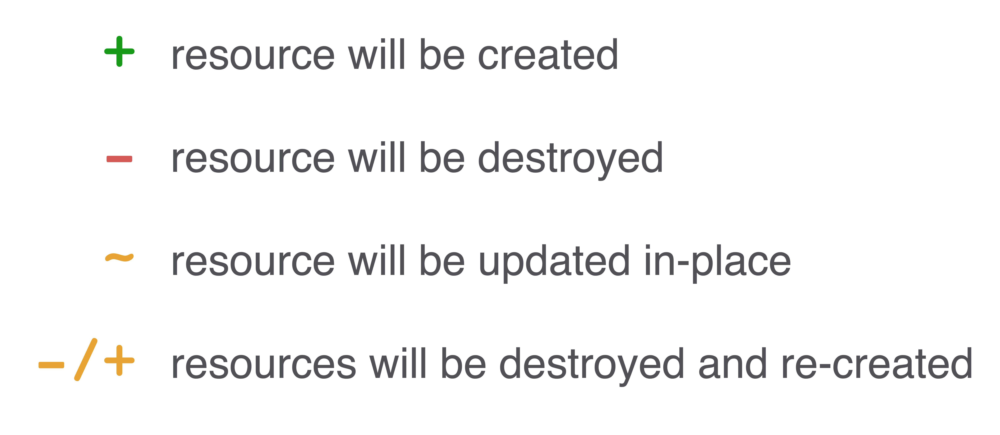

# Lab: Generate and review an execution plan with `terraform plan`

The `terraform plan` command performs a dry-run of executing your terraform configuration and checks whether the proposed changes match what you expect before you apply the changes or share your changes with your team for broader review.

- Task 1: Generate and Review a plan
- Task 2: Save a Terraform plan
- Task 3: No Change Plans
- Task 4: Refresh Only plans

# Task 1: Generate and Review a plan

Prior to Terraform, users had to guess change ordering, parallelization, and rollout effect of their code. Terraform alleviates the guessing by creating a plan by performing the following steps <Trước Terraform, người dùng phải đoán thứ tự thay đổi, sự song song hóa và hiệu ứng triển khai mã của họ. Terraform giúp giảm bớt việc phỏng đoán bằng cách tạo một kế hoạch bằng cách thực hiện các bước sau:>:

- Reading the current state of any already-existing remote objects to make sure that the Terraform state is up-to-date <Reading the current state của mọi đối tượng từ xa đã tồn tại để đảm bảo rằng Terraform state được cập nhật.>.
- Comparing the current configuration to the prior state and noting any differences <So sánh cấu hình hiện tại với trạng thái trước đó và ghi nhận bất kỳ sự khác biệt nào>.
- Proposing a set of change actions that should, if applied, make the remote objects match the configuration <Đề xuất một tập hợp các change actions, nếu được áp dụng, sẽ làm cho các remote object match the configuration>.

```shell
terraform plan
```

The plan shows you what will happen and the reasons for certain actions (such as re-create).



Terraform plans do not make any changes to your infrastructure they only report what will occur if a plan is executed against using a `terraform apply`.

# Task 2: Save a Terraform plan

The `terraform plan` command supports a number of different options, subcommands and customization options. These options can be reviewed using `terraform plan -help`.

```shell
terraform plan -help
```

You can save plans to a file to guarantee what will happen

```shell
terraform plan -out=myplan
```

```shell
.
|-- MyAWSKey.pem
|-- main.tf
|-- myplan
|-- terraform.tf
|-- terraform.tfstate
|-- terraform.tfstate.backup
|-- variables.tf
```

You can also look at the details of a given plan file by running a `terraform show` command.

```shell
terraform show myplan
```

# Task 3: No Change Plans

As you can see the plan command within Terraofrm is extremly powerful for identifying any changes that need to occur against your configuration and the already deployed infrastructure. The plan command is also extremely powerful to validate that your real insfrastructure and configuration are in sync. If this is true, the plan command will indicate that there are `No changes`. This is sometimes referred to a a `No Change Plan` or `Zero Change Plan` and is extremly valuable.

```shell
No changes. Your infrastructure matches the configuration.

Terraform has compared your real infrastructure against your configuration and found no differences, so no changes are needed.
```

Because the `terraform plan` makes no changes to your infrastructure it can be run at any time without any penalty. In fact it should be run freqently to detect drift between your deployed infrastructure and configuration. A `No Change Plan` indicates that there is no drift.

The `terraform plan` should also be run after any terraform configuration has been refactored. Perhaps the configuration has been refactored to make use of variables or a different set of data constructs to make the code more reusable or easier to read. If these changes are merely to refactor code but should not result in an changes to your deployed infrastructure, a `No Change Plan` can be used to verify that the refactoring exercise were benign.

# Task 4: Refresh Only plans

The first step of the `terraform plan` process is to read the current state of any already-existing remote objects to make sure that the Terraform state is up-to-date. It will then compare the current configuration to the prior state and note differences. If you wish to only perform the first part of this flow you can execute the plan with a `-refresh-only` option to make the

Change the tag of a given object inside the AWS Console


```
terraform plan -refresh-only`
```

```shell
Note: Objects have changed outside of Terraform

Terraform detected the following changes made outside of Terraform since the last "terraform
apply":

  # aws_instance.web_server has been changed
  ~ resource "aws_instance" "web_server" {
        id                                   = "i-0da540d207d546644"
      ~ tags                                 = {
          + "Team" = "Engineering"
            # (1 unchanged element hidden)
        }
      ~ tags_all                             = {
          + "Team"        = "Engineering"
            # (4 unchanged elements hidden)
        }
        # (27 unchanged attributes hidden)


        # (5 unchanged blocks hidden)
    }

This is a refresh-only plan, so Terraform will not take any actions to undo these. If you were expecting these changes then you can apply this plan to record the updated values in the Terraform state without changing any remote objects.
```

Terraform's Refresh-only mode goal is only to update the Terraform state and any root module output values to match changes made to remote objects outside of Terraform. This can be useful if you've intentionally changed one or more remote objects outside of the usual workflow (e.g. while responding to an incident) and you now need to reconcile Terraform's records with those changes.
